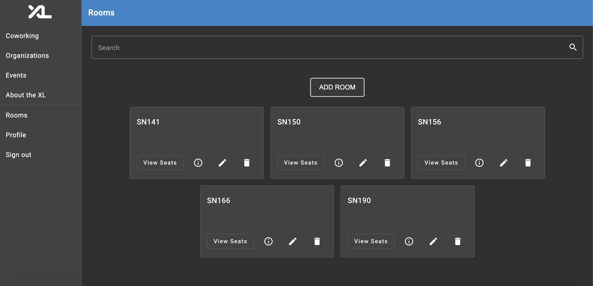
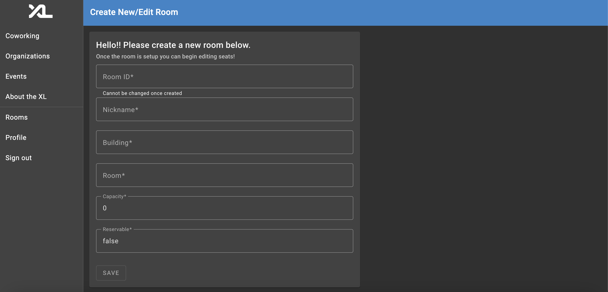
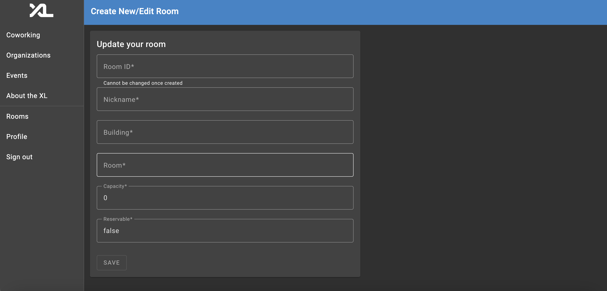
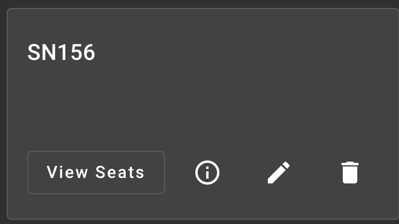
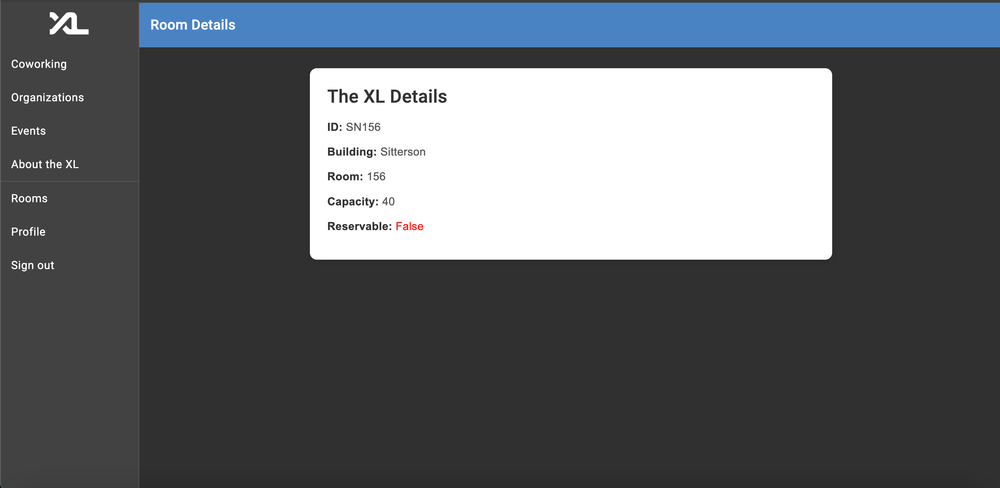
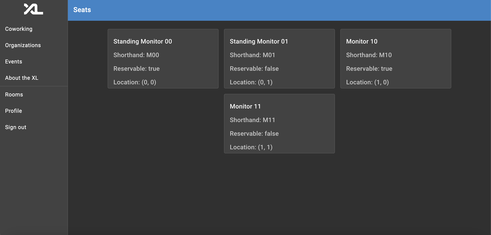
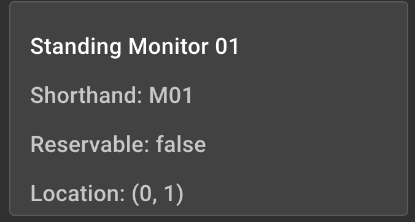

# Technical Specification Document

## Important Notice for Developers

Before proceeding with testing the backend and frontend components of the project, it is essential that your development environment is set up. Please refer to the setup guide in [Get Started with Development](https://github.com/comp423-23f/csxl-final-team-d8/blob/086f4b18a582937208cc580dc9c5537fc070fa85/docs/get_started.md), which covers all necessary steps such as installing dependencies, setting up environment variables, and other prerequisites.

## Overview

This document specifies the functionality and implementation of the project. It is split into two main sections, the backend and frontend. This document aims to provide clarity on the application's architecture, data models, and API routes.

## Backend

The backend serves as the backbone of our application by handling data processing and database interactions. Its purpose is to provide support to the frontend through API routes and service functions.

### API Routes

The following RESTful API routes are exposed in the backend, which enables the frontend to perform operations such as creating, reading, updating, and deleting data.

#### `GET` `/api/rooms` - Retrieve a list of rooms (rooms.py)

Example response:

```
[
  {
    "id": "SN156",
    "nickname": "The XL",
    "building": "Sitterson",
    "room": "156",
    "capacity": 40,
    "reservable": False,
    "seats": []
  }
]
```

`get_rooms` is used to return a list of all the existing rooms in the database.

#### `GET` `/api/rooms/{id}` - Retrieve room by ID (rooms.py)

(The example response is identical to previous route)

`get_room_from_id` is used to return a `RoomDetails` with a matching ID. If it cannot be found based on the id, an exception is raised which will cause an `HTTPException 404` error.

#### `POST` `/api/rooms` - Create a room (rooms.py)

Example response:

```
{
  "id": "SN135",
  "nickname": "Group A"
}
```

`new_room` is used to return a `Room` that is to be added to the database. If the `Room` cannot be created, an exception is raised which will cause an `HTPPException 422` error.

#### `DELETE` `/api/rooms/{id}` - Delete a room by ID (rooms.py)

Example of unsuccessful response:

```
{
  "detail": "No room found matching id: SN135"
}
```

`delete_room` is used to delete a `Room` with a matching ID in the database. If the `Room` cannot be deleted based on the id, an exception is raised which will cause an `HTTPException 404` error.

#### `PUT` `/api/rooms` - Update a room (rooms.py)

Example response:

```
{
  "id": "SN135",
  "nickname": "Group A"
}
```

`update_room` is used to return an updated `Room`. If the `Room` cannot be updated because it does not exist or is not found, an exception is raised which will cause an `HTTPException 404` error.

#### `GET` `/api/seats/{id}` - Retrieves list of all seats in a room (seats.py)

Example response:

```
[
  {
    "id": 0,
    "title": "string",
    "shorthand": "string",
    "reservable": true,
    "has_monitor": true,
    "sit_stand": true,
    "x": 0,
    "y": 0
  }
]
```

`get_room_seats` is used to return a list of all the seats in a `Room` from the database.

### Service Functions

The following service functions are all in `RoomService`, which is used by the API routes and is essential for the functionality of deleting, editing, and adding rooms.

#### `list()` returns list of rooms in database

#### `create()` creates a room and adds it to database

#### `delete()` deletes a room based on a provided id

#### `update()` updates a room based on room id

#### `get_from_id()` retrieves a room from a unique id

The following service function is in `SeatService`, which is used by the API routes and is essential for the functionality of listing seats.

#### `room_seats()` returns list of seats in a room based on provided id

## Frontend

#### Room Page Component


This component is responsible for displaying the existing rooms in the database. At the top of the page is the search bar, which allows you to search for a specific room. The feature of the button that is titled `ADD ROOM` navigates you to the Room Manage component where Rhonda Root can add a new `Room` to the current database. Below that are room cards for all the rooms in the database.

#### Room Manage Component



This page displays the form that you as Rhonda Root must fill out when creating a new `Room` that will be added to the database, or you as an XL Ambassador or Rhonda Root must fill out when editing an existing `Room` in the database. The heading text is different based on if you are creating or editing.

#### Room Card Widget


This widget displays the `Room` id and has buttons to view its seats, view its info, edit the room, and delete it. The `View Seats` button routes you to the Seat Page component, the details button routes you to the Room Info component, and the edit room button takes you to the Room Manage component.

#### Room Info Component


This component displays all of the information for a specific `Room`.

#### Seat Page Component


This component is responsible for displaying the existing seats for a room from the database. The seats are displayed using the seat card widget.

#### Seat Card Widget


This widget displays the `Seat` title and some other information for all the seats in a specific `Room`.

## Technical/User Experience Design

The button in the room page that routes the user to a room manage page where they can add and edit rooms. The alternative would be to have this link in the navigation sidebar, which would not be as user friendly. Each widget card that represents a `Room` in the database, has a trash icon to delete the room and a pencil icon to update the room, ensuring a friendly user experience. To ensure a smooth experience for finding a specific room, the page has a search bar that filters the room based on a given query.
